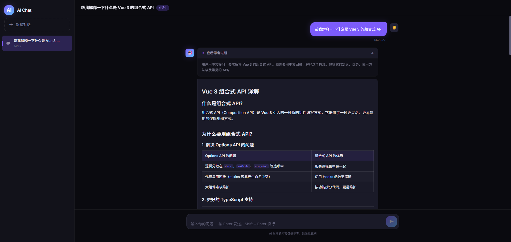

<div align="center">

<h1>🤖 AI Chat</h1>
<p>基于 MiniMax 大模型的全栈流式对话应用</p>



</div>

---

## ✨ 功能特性

- 💬 **流式对话** — SSE 实时推送，逐字显示 AI 回答
- 🧠 **思考过程可视化** — 展示 AI 的推理过程，可折叠查看
- 📝 **Markdown 渲染** — 支持代码高亮、表格、列表等富文本格式
- 🗂️ **多会话管理** — 创建、切换、删除对话，自动保存历史
- 🔄 **多轮上下文** — 携带最近 20 条历史记录，支持连续对话
- 🛑 **对话中止** — 随时停止 AI 生成，保留已接收内容
- 🌙 **暗色主题** — Glassmorphism 风格 UI，现代感十足

## 🛠️ 技术栈

| 层级    | 技术                                                             |
| ------- | ---------------------------------------------------------------- |
| 前端    | Vue 3 + Vite + Tailwind CSS v4                                   |
| 后端    | Spring Boot 3 + WebFlux (WebClient)                              |
| 数据库  | MySQL + Easy-Query ORM                                           |
| AI 模型 | [MiniMax M2.5](https://platform.minimaxi.com)（OpenAI 兼容 API） |

## 🚀 快速开始

### 前置条件

- Node.js 18+、pnpm
- JDK 17+、Gradle
- MySQL 8+
- [MiniMax API Key](https://platform.minimaxi.com)

### 1. 数据库初始化

```sql
CREATE DATABASE ai_chat DEFAULT CHARSET utf8mb4;
```

数据表会在应用首次启动时通过 Easy-Query 自动同步。

### 2. 配置后端

编辑 `server/src/main/resources/application.yaml`：

```yaml
spring:
  datasource:
    url: jdbc:mysql://localhost:3306/ai_chat?useUnicode=true&characterEncoding=utf-8&serverTimezone=Asia/Shanghai
    username: your_username
    password: your_password

minimax:
  api-key: your_minimax_api_key # 在 MiniMax 开放平台获取
  model: MiniMax-M2.5
```

### 3. 启动后端

```bash
cd server
./gradlew bootRun
# 服务运行在 http://localhost:8080
```

### 4. 启动前端

```bash
cd web
pnpm install
pnpm dev
# 访问 http://localhost:5173
```

## 📁 项目结构

```
ai-chat/
├── server/                          # Spring Boot 后端
│   └── src/main/java/org/example/server/
│       ├── controller/ChatController.java   # REST + SSE 接口
│       ├── service/ChatService.java         # 核心业务，对接 MiniMax
│       ├── domain/                          # 实体类
│       └── config/MiniMaxConfig.java        # AI 配置
└── web/                             # Vue 3 前端
    └── src/
        ├── App.vue                  # 根组件，状态管理
        ├── api/chat.js              # SSE 流式解析
        └── components/
            ├── Sidebar.vue          # 会话列表
            ├── ChatWindow.vue       # 消息区域
            ├── MessageBubble.vue    # 消息气泡（Markdown + 思考过程）
            └── MessageInput.vue     # 输入框 + 中止按钮
```

## 📄 License

MIT
